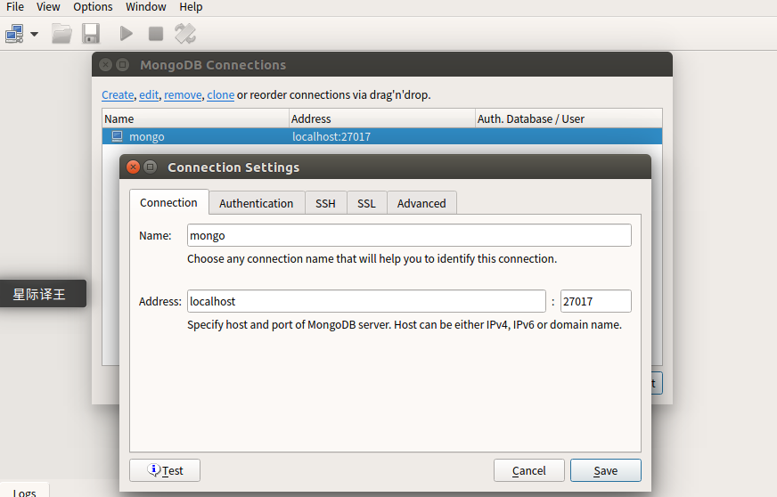

# 基本操作

- MongoDB将数据存储为一个文档，数据结构由键值(key=>value)对组成
- MongoDB文档类似于JSON对象，字段值可以包含其他文档、数组、文档数组
- 安装管理mongodb环境
- 完成数据库、集合的管理
- 数据的增加、修改、删除、查询

#### 名词

| SQL术语/概念 | MongoDB术语/概念 | 解释/说明                           |
| ------------ | ---------------- | ----------------------------------- |
| database     | database         | 数据库                              |
| table        | collection       | 数据库表/集合                       |
| row          | document         | 数据记录行/文档                     |
| column       | field            | 数据字段/域                         |
| index        | index            | 索引                                |
| table joins  |                  | 表连接,MongoDB不支持                |
| primary key  | primary key      | 主键,MongoDB自动将_id字段设置为主键 |

- 三元素：数据库，集合，文档
  - 集合就是关系数据库中的表
  - 文档对应着关系数据库中的行
- 文档，就是一个对象，由键值对构成，是json的扩展Bson形式

```
{'name':'guojing','gender':'男'}
```

- 集合：类似于关系数据库中的表，储存多个文档，结构不固定，如可以存储如下文档在一个集合中

```
{'name':'guojing','gender':'男'}
{'name':'huangrong','age':18}
{'book':'shuihuzhuan','heros':'108'}
```

- 数据库：是一个集合的物理容器，一个数据库中可以包含多个文档
- 一个服务器通常有多个数据库

---

# 安装

- 下载mongodb的版本，两点注意
  - 根据业界规则，偶数为稳定版，如1.6.X，奇数为开发版，如1.7.X
  - 32bit的mongodb最大只能存放2G的数据，64bit就没有限制
- 到官网，选择合适的版本下载
- 解压

```
tar -zxvf mongodb-linux-x86_64-ubuntu1604-3.4.0.tgz
```

- 移动到/usr/local/目录下

```
sudo mv -r mongodb-linux-x86_64-ubuntu1604-3.4.0/ /usr/local/mongodb
```

- 将可执行文件添加到PATH路径中

```
export PATH=/usr/local/mongodb/bin:$PATH
```

# 管理mongo

- 配置文件在/etc/mongod.conf
- 默认端口27017
- 启动

```
sudo service mongod start
```

- 停止

```
sudo service mongod stop
```

- 使用终端连接
- 这个shell就是mongodb的客户端，同时也是一个js的编译器

```
mongo
```

- 命令

```
db查看当前数据库名称
db.stats()查看当前数据库信息
```

- 终端退出连接

```
exit
或ctrl+c
```

- GUI：robomongo，解压后在bin目录下找到运行程序
- 如下

