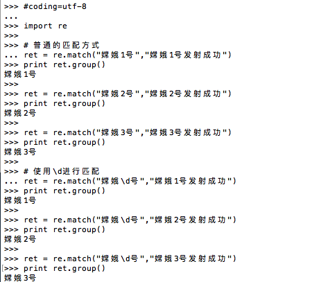
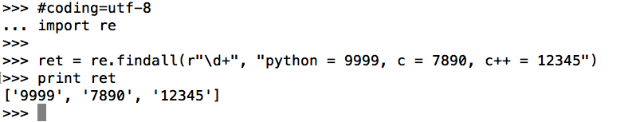
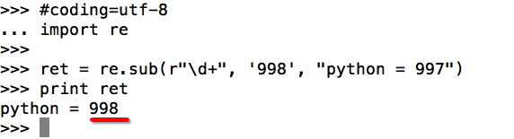
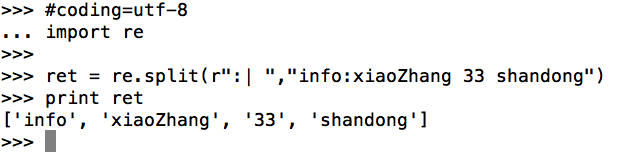

# re模块

- 常见的匹配符号

| 匹配字符 | 功能                             |
| -------- | -------------------------------- |
| .        | 匹配任意1个字符（除了\n）        |
| [ ]      | 匹配[ ]中列举的字符              |
| \d       | 匹配数字，即0-9                  |
| \D       | 匹配非数字，即不是数字           |
| \s       | 匹配空白，即 空格，tab键         |
| \S       | 匹配非空白                       |
| \w       | 匹配单词字符，即a-z、A-Z、0-9、_ |
| \W       | 匹配非单词字符                   |

| 匹配数量 | 功能                                                |
| -------- | --------------------------------------------------- |
| *        | 匹配前一个字符出现0次或者无限次，即可有可无         |
| +        | 匹配前一个字符出现1次或者无限次，即至少有1次        |
| ?        | 匹配前一个字符出现1次或者0次，即要么有1次，要么没有 |
| {m}      | 匹配前一个字符出现m次                               |
| {m,}     | 匹配前一个字符至少出现m次                           |
| {m,n}    | 匹配前一个字符出现从m到n次                          |

| 匹配边界 | 功能               |
| -------- | ------------------ |
| ^        | 匹配字符串开头     |
| $        | 匹配字符串结尾     |
| \b       | 匹配一个单词的边界 |
| \B       | 匹配非单词边界     |

| 匹配分组     | 功能                             |
| ------------ | -------------------------------- |
| \|           | 匹配左右任意一个表达式           |
| (ab)         | 将括号中字符作为一个分组         |
| `\num`       | 引用分组num匹配到的字符串        |
| `(?P<name>)` | 分组起别名                       |
| (?P=name)    | 引用别名为name分组匹配到的字符串 |

- re.match(patter, string, flag) ：能够匹配出以xxx开头的字符串

  

- re.search(patter, string, flag) ：能够匹配出以任意位置的字符串

- re.findall(patter, string, flag) ：能够匹配出以任意位置，所有匹配到的字符串

  

- re.sub(pattern, repl, string, count=0, flags=0) : 将匹配到的字符进行替换 

- re.split(pattern, string, maxsplit=0, flags=0): 根据匹配切割字符串，返回列表

  

  ​

  ​

