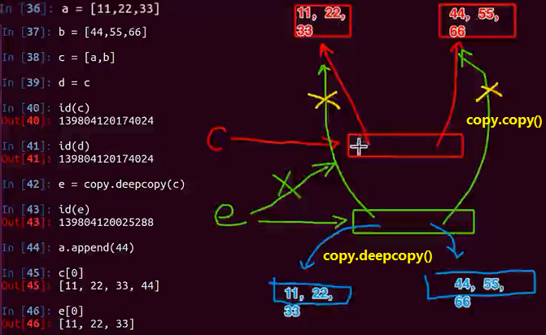
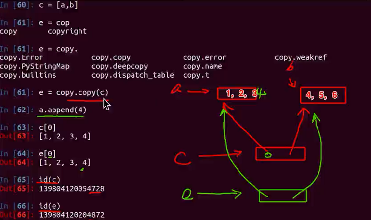

---

---

# Python高级

#### 1、模块重载入

​	用于模块被外部修改后需要重新载入的情况

```python
>>>　from imp import reload
>>>  reload(md5_code) #假设是md5_code.py模块
```


#### 2、循环导入

​	假设A模块需要调用B模块的b()，B模块的b()中又调用了A模块中的a()，此时出现循环导入的现象。

解决方法：

（1）设计的时候就独立a()、b()，让C模块调用a()、b()。

（2）放在函数题目导入


#### 3、is和==

（1）is用来比较是否指向了同一个对象，即id()之后相等。

（2）==比较的是值相等


#### 4、深拷贝和浅拷贝

##### （1）列表的深浅拷贝



##### （2）copy.deepcopy() 、copy.copy()的区别

copy.deepcopy()：能把所有的引用都识别，进行深拷贝

copy.copy()：只能对可变类型（tuple除外）进行第一层深拷贝




#### 5、属性property

（1）私有属性添加getter和setter方法

```python
class Money(object):
    def __init__(self):
        self.__money = 0
        
    def getMoney(self):
        return self.__money
    
    def setMoney(self, value):
        if isinstance(value, int):
            self.__money = value     
            
t = Money()
t.setMoney(200)
print(t.getMoney())
```

（2）使用property升级getter和setter方法：

```python
class Money(object):
    def __init__(self):
        self.__money = 0
        
    def getMoney(self):
        return self.__money
    
    def setMoney(self, value):
        if isinstance(value, int):
            self.__money = value   
    money = property(getMoney, setMoney)
    
t = Money()
t.money = 200
print(t.money)
```

（3）使用property的装饰器方法

```python
class Money(object):
    def __init__(self):
        self.__money = 0
     
    # 即getter方法
    @property    
    def money(self):
        return self.__money
    
    #即setter方法
    @money.setter
    def money(self, value):
        if isinstance(value, int):
            self.__money = value  
            
t = Money()
t.money = 200
print(t.money)
```


#### 6、闭包

（1）应用(构造直线)

```python
def line_init(a,b,c):
    def line_in(x):
        return a*x*x+b*x+c
    return line_in

line = line_init(10,20,5) # 构造基数
print(line(3))
```


#### 7、装饰器

（1）功能

- 引入日志
- 函数执行时间统计
- 执行函数前预备处理
- 执行函数后清理功能
- 权限校验等场景
- 缓存

（2）功能示例（头-尾-中）

```python
#定义函数：完成包裹数据
def w1(func):
    print("--start--装载权限w1----(step3)")
    def wrapped():
        print("----正在验证权限w1----(step5)")
        func()
        print("----正在验证权限w2----(step8)")
    print("--end--卸载权限w2----(step4)")
    return wrapped

#定义函数：完成包裹数据
def w2(func):
    print("--start--装载权限w2----(step1)")
    def wrapped():
        print("----正在验证权限w2----(step6)")
        func()
        print("----正在验证权限w2----(step7)")
    print("--end--卸载权限w2----(step2)")
    return wrapped

# @w1
# def test1():
    print("hello world-1") 

# @w2
# def test2():
    print("hello world-2") 

@w1
@w2
def test3():
    print ("hello world-3") 

# test1()  
# test2() 
test3()  # 打印顺序见step的顺序
```

（3） 装饰器示例汇总

##### 例1:无参数的函数

```python
from time import ctime, sleep

def timefun(func):
    def wrappedfunc():
        print("%s called at %s"%(func.__name__, ctime()))
        func()
    return wrappedfunc

@timefun
def foo():
    print("I am foo")

foo()
sleep(2)
foo()

```

上面代码理解装饰器执行行为可理解成

```python
foo = timefun(foo)
#foo先作为参数赋值给func后,foo接收指向timefun返回的wrappedfunc
foo()
#调用foo(),即等价调用wrappedfunc()
#内部函数wrappedfunc被引用，所以外部函数的func变量(自由变量)并没有释放
#func里保存的是原foo函数对象
```

##### 例2:被装饰的函数有参数

```python
from time import ctime, sleep

def timefun(func):
    def wrappedfunc(a, b):
        print("%s called at %s"%(func.__name__, ctime()))
        print(a, b)
        func(a, b)
    return wrappedfunc

@timefun
def foo(a, b):
    print(a+b)

foo(3,5)
sleep(2)
foo(2,4)
```

##### 例3:被装饰的函数有不定长参数

```python
from time import ctime, sleep

def timefun(func):
    def wrappedfunc(*args, **kwargs):
        print("%s called at %s"%(func.__name__, ctime()))
        func(*args, **kwargs)
    return wrappedfunc

@timefun
def foo(a, b, c):
    print(a+b+c)

foo(3,5,7)
sleep(2)
foo(2,4,9)

```

##### 例4:装饰器中的return

```python
from time import ctime, sleep

def timefun(func):
    def wrappedfunc():
        print("%s called at %s"%(func.__name__, ctime()))
        func()
    return wrappedfunc

@timefun
def foo():
    print("I am foo")

@timefun
def getInfo():
    return '----hahah---'

foo()
sleep(2)
foo()


print(getInfo())

```

执行结果:

```python
foo called at Fri Nov  4 21:55:35 2016
I am foo
foo called at Fri Nov  4 21:55:37 2016
I am foo
getInfo called at Fri Nov  4 21:55:37 2016
None

```

如果修改装饰器为`return func()`，则运行结果：

```python
foo called at Fri Nov  4 21:55:57 2016
I am foo
foo called at Fri Nov  4 21:55:59 2016
I am foo
getInfo called at Fri Nov  4 21:55:59 2016
----hahah---

```

> 总结：
>
> 一般情况下为了让装饰器更通用，可以有return

##### 例5：装饰器添加外部参数

```python
#decorator2.py

from time import ctime, sleep

def timefun_arg(pre="hello"):
    def timefun(func):
        def wrappedfunc():
            print("%s called at %s %s"%(func.__name__, ctime(), pre))
            return func()
        return wrappedfunc
    return timefun

@timefun_arg("itcast")
def foo():
    print("I am foo")

@timefun_arg("python")
def too():
    print("I am too")

foo()
sleep(2)
foo()

too()
sleep(2)
too()

```

可以理解为

```
foo()==timefun_arg("itcast")(foo)()

```

##### 例6：类装饰器（扩展，非重点）

装饰器函数其实是这样一个接口约束，它必须接受一个callable对象作为参数，然后返回一个callable对象。在Python中一般callable对象都是函数，但也有例外。只要某个对象重写了 `__call__()` 方法，那么这个对象就是callable的。

```python
class Test():
    def __call__(self):
        print('call me!')

t = Test()
t()  # call me

```

类装饰器demo

```python
class Test(object):
    def __init__(self, func):
        print("---初始化---")
        print("func name is %s"%func.__name__)
        self.__func = func
    def __call__(self):
        print("---装饰器中的功能---")
        self.__func()
#说明：
#1. 当用Test来装作装饰器对test函数进行装饰的时候，首先会创建Test的实例对象
#    并且会把test这个函数名当做参数传递到__init__方法中
#    即在__init__方法中的func变量指向了test函数体
#
#2. test函数相当于指向了用Test创建出来的实例对象
#
#3. 当在使用test()进行调用时，就相当于让这个对象()，因此会调用这个对象的__call__方法
#
#4. 为了能够在__call__方法中调用原来test指向的函数体，所以在__init__方法中就需要一个实例属性来保存这个函数体的引用
#    所以才有了self.__func = func这句代码，从而在调用__call__方法中能够调用到test之前的函数体
@Test
def test():
    print("----test---")
test()
showpy()#如果把这句话注释，重新运行程序，依然会看到"--初始化--"

```

运行结果如下：

```python
---初始化---
func name is test
---装饰器中的功能---
----test---
```


#### 8、元类

- 认识元类

（1）python2中

```python
#-*- coding:utf-8 -*-
def upper_attr(future_class_name, future_class_parents, future_class_attr)
	#遍历属性字典，把不是__开头的属性名字变为写
	newAttr = {}
	for name,value in future_class_attr.items():
		if not name.startswith("__"):
			newAttr[name.upper()] = value
	#调用type来创建类
	return type(future_class_name, future_class_parents, newAttr)

class Foo(object):
	__metaclass__ = upper_attr #设置Foo类的元类为upper_attr
	bar = 'bip'

print(hasattr(Foo, 'bar'))
print(hasattr(Foo, 'BAR'))
f = Foo()
print(f.BAR)
```

（2）python3中

```python
#-*- coding:utf-8 -*-
def upper_attr(future_class_name, future_class_parents, future_class_attr)
    #遍历属性字典，把不是__开头的属性名字变为大写
    newAttr = {}
    for name,value in future_class_attr.items():
        if not name.startswith("__"):
        	newAttr[name.upper()] = value
    #调用type来创建类
    return type(future_class_name, future_class_parents, newAttr)

class Foo(object, metaclass=upper_attr):
    bar = 'bip'
    
print(hasattr(Foo, 'bar'))
print(hasattr(Foo, 'BAR'))
f = Foo()
print(f.BAR)
```

- 正式的元类

```python
#coding=utf-8
class UpperAttrMetaClass(type):
    # __new__ 是在__init__之前被调用的特殊方法
    # __new__是来创建对象并返回之的方法
    # __init__只是用来将传递的参数初始化给对象
    # 你很少用到__new__，除非你希望能够控制对象的创建
    # 创建的对象是类，我们希望能够自定义它，所以我们改写__new__
    # 如果你希望的话，你也可以在__init__中做些事情
    # 还有一些高级的方法会涉及到改写__call__特殊方法，但是我们这里不需要
    def __new__(cls, future_class_name, future_class_parents, future_class_attr)
    #遍历属性字典，把不是__开头的属性名字变为⼤写
        newAttr = {}
        for name,value in future_class_attr.items():
        if not name.startswith("__"):
        newAttr[name.upper()] = value
        # 方法1：通过'type'来做类对象的创建
        # return type(future_class_name, future_class_parents, newAttr)
        # 方法2：复用type.__new__
        # 这就是基本的OOP编程，没什么魔法
        # return type.__new__(cls, future_class_name, future_class_parents, newAttr)
        # 方法3：使用super
        return super(UpperAttrMetaClass, cls).__new__(cls, future_class_name,
                                                      future_class_parents, newAttr)
#python2
class Foo(object):
    __metaclass__ = UpperAttrMetaClass
    bar = 'bip'
    
# python3
# class Foo(object, metaclass = UpperAttrMetaClass):
# 	bar = 'bip'

print(hasattr(Foo, 'bar'))
# 输出: False
print(hasattr(Foo, 'BAR'))
# 输出:True
f = Foo()
print(f.BAR)
# 输出:'bip'
```


#### 9、getattribute

```python
class Person(object):
    def __getattribute__(self,attr):
        if obj.startwith("t"):
            return "haha"
        else:
            tmp = object.__getattribute__(self, attr)
            return tmp
        
        def show():
            print("show")
 
p = Person()
p.test()
p.show()
```

#### 

#### 10、PDB的使用

> 显示当前的代码：l--->list  
>
> 向下执行一行代码：n--->next 
>
> 继续执行代码：c--->continue 
>
> 添加断点：b--->break 
>
> 删除断点：clear [break num]    
>
> 进入到一个函数：s--->step 
>
> 打印所有的形参数据：a--->args 
>
> 打印变量 ：p [arg]  
>
> 退出调试：q