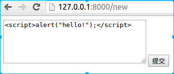
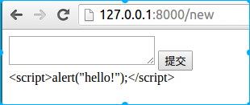

# 使用模板

## 1. 路径与渲染

使用模板，需要仿照静态文件路径设置一样，向web.Application类的构造函数传递一个名为**template_path**的参数来告诉Tornado从文件系统的一个特定位置提供模板文件，如：

```
app = tornado.web.Application(
    [(r'/', IndexHandler)],
    static_path=os.path.join(os.path.dirname(__file__), "statics"),
    template_path=os.path.join(os.path.dirname(__file__), "templates"),
)
```

在这里，我们设置了一个当前应用目录下名为templates的子目录作为template_path的参数。在handler中使用的模板将在此目录中寻找。

现在我们将静态文件目录statics/html中的index.html复制一份到templates目录中，此时文件目录结构为：

```
.
├── statics
│   ├── css
│   │   ├── index.css
│   │   ├── main.css
│   │   └── reset.css
│   ├── html
│   │   └── index.html
│   ├── images
│   │   ├── home01.jpg
│   │   ├── home02.jpg
│   │   ├── home03.jpg
│   │   └── landlord01.jpg
│   ├── js
│   │   ├── index.js
│   │   └── jquery.min.js
│   └── plugins
│       ├── bootstrap
│       │   └─...
│       └── font-awesome
│           └─...
├── templates
│   └── index.html
└── test.py
```

**在handler中使用render()方法来渲染模板并返回给客户端**。

```
class IndexHandler(RequestHandler):
    def get(self):
        self.render("index.html") # 渲染主页模板，并返回给客户端。


current_path = os.path.dirname(__file__)
app = tornado.web.Application(
    [
        (r'^/$', IndexHandler),
        (r'^/view/(.*)$', StaticFileHandler, {"path":os.path.join(current_path, "statics/html")}),
    ],
    static_path=os.path.join(current_path, "statics"),
    template_path=os.path.join(os.path.dirname(__file__), "templates"),
)
```

## 2. 模板语法

### 2-1 变量与表达式

在tornado的模板中使用{{}}作为变量或表达式的占位符，使用render渲染后占位符{{}}会被替换为相应的结果值。

我们将index.html中的一条房源信息记录

```
<li class="house-item">
    <a href=""></a>
    <div class="house-desc">
        <div class="landlord-pic"></div>
        <div class="house-price">￥<span>398</span>/晚</div>
        <div class="house-intro">
            <span class="house-title">宽窄巷子+160平大空间+文化保护区双地铁</span>
            <em>整套出租 - 5分/6点评 - 北京市丰台区六里桥地铁</em>
        </div>
    </div>
</li>
```

改为模板：

```
<li class="house-item">
    <a href=""></a>
    <div class="house-desc">
        <div class="landlord-pic"></div>
        <div class="house-price">￥<span>{{price}}</span>/晚</div>
        <div class="house-intro">
            <span class="house-title">{{title}}</span>
            <em>整套出租 - {{score}}分/{{comments}}点评 - {{position}}</em>
        </div>
    </div>
</li>
```

渲染方式如下：

```
class IndexHandler(RequestHandler):
    def get(self):
        house_info = {
            "price": 398,
            "title": "宽窄巷子+160平大空间+文化保护区双地铁",
            "score": 5,
            "comments": 6,
            "position": "北京市丰台区六里桥地铁"
        }
        self.render("index.html", **house_info)
```

{{}}不仅可以包含变量，还可以是表达式，如：

```
<li class="house-item">
    <a href=""></a>
    <div class="house-desc">
        <div class="landlord-pic"></div>
        <div class="house-price">￥<span>{{p1 + p2}}</span>/晚</div>
        <div class="house-intro">
            <span class="house-title">{{"+".join(titles)}}</span>
            <em>整套出租 - {{score}}分/{{comments}}点评 - {{position}}</em>
        </div>
    </div>
</li>
```

```
class IndexHandler(RequestHandler):
    def get(self):
        house_info = {
            "p1": 198,
            "p2": 200,
            "titles": ["宽窄巷子", "160平大空间", "文化保护区双地铁"],
            "score": 5,
            "comments": 6,
            "position": "北京市丰台区六里桥地铁"
        }
        self.render("index.html", **house_info)
```

### 2-2 控制语句

可以在Tornado模板中使用Python条件和循环语句。控制语句以{\%和\%}包围，并以类似下面的形式被使用：

```

```

或

```

```

控制语句的大部分就像对应的Python语句一样工作，支持if、for、while，**注意end**:

```
 ...  ...  ... 
 ... 
 ... 
```

再次修改index.html:

```
<ul class="house-list">
    
        
        <li class="house-item">
            <a href=""></a>
            <div class="house-desc">
                <div class="landlord-pic"></div>
                <div class="house-price">￥<span>{{house["price"]}}</span>/晚</div>
                <div class="house-intro">
                    <span class="house-title">{{house["title"]}}</span>
                    <em>整套出租 - {{house["score"]}}分/{{house["comments"]}}点评 - {{house["position"]}}</em>
                </div>
            </div>
        </li>
        
    
        对不起，暂时没有房源。
    
</ul>
```

python中渲染语句为：

```
class IndexHandler(RequestHandler):
    def get(self):
        houses = [
        {
            "price": 398,
            "title": "宽窄巷子+160平大空间+文化保护区双地铁",
            "score": 5,
            "comments": 6,
            "position": "北京市丰台区六里桥地铁"
        },
        {
            "price": 398,
            "title": "宽窄巷子+160平大空间+文化保护区双地铁",
            "score": 5,
            "comments": 6,
            "position": "北京市丰台区六里桥地铁"
        },
        {
            "price": 398,
            "title": "宽窄巷子+160平大空间+文化保护区双地铁",
            "score": 5,
            "comments": 6,
            "position": "北京市丰台区六里桥地铁"
        },
        {
            "price": 398,
            "title": "宽窄巷子+160平大空间+文化保护区双地铁",
            "score": 5,
            "comments": 6,
            "position": "北京市丰台区六里桥地铁"
        },
        {
            "price": 398,
            "title": "宽窄巷子+160平大空间+文化保护区双地铁",
            "score": 5,
            "comments": 6,
            "position": "北京市丰台区六里桥地铁"
        }]
        self.render("index.html", houses=houses)
```

### 2-3 函数

#### static_url()

Tornado模板模块提供了一个叫作static_url的函数来生成静态文件目录下文件的URL。如下面的示例代码：

```
<link rel="stylesheet" href="{{ static_url("style.css") }}">
```

这个对static_url的调用生成了URL的值，并渲染输出类似下面的代码：

```
<link rel="stylesheet" href="/static/style.css?v=ab12">
```

**优点：**

- static_url函数创建了一个基于文件内容的hash值，并将其添加到URL末尾（查询字符串的参数v）。这个hash值确保浏览器总是加载一个文件的最新版而不是之前的缓存版本。无论是在你应用的开发阶段，还是在部署到生产环境使用时，都非常有用，因为你的用户不必再为了看到你的静态内容而清除浏览器缓存了。
- 另一个好处是你可以改变你应用URL的结构，而不需要改变模板中的代码。例如，可以通过设置**static_url_prefix**来更改Tornado的默认静态路径前缀/static。如果使用static_url而不是硬编码的话，代码不需要改变。

#### 转义

我们新建一个表单页面new.html

```
<!DOCTYPE html>
<html>
    <head>
        <title>新建房源</title>
    </head>
    <body>
        <form method="post">
            <textarea name="text"></textarea>
            <input type="submit" value="提交">
        </form>
        {{text}}
    </body>
</html>
```

对应的handler为：

```
class NewHandler(RequestHandler):

    def get(self):
        self.render("new.html", text="")

    def post(self):
        text = self.get_argument("text", "") 
        print text
        self.render("new.html", text=text)
```

当我们在表单中填入如下内容时：

```
<script>alert("hello!");</script>
```



写入的js程序并没有运行，而是显示出来了：



我们查看页面源代码，发现<、>、"等被转换为对应的html字符。

```
&lt;script&gt;alert(&quot;hello!&quot;);&lt;/script&gt;
```

这是因为tornado中默认开启了模板自动转义功能，防止网站受到恶意攻击。

我们可以通过raw语句来输出不被转义的原始格式，如：

```

```

> 注意：在Firefox浏览器中会直接弹出alert窗口，而在Chrome浏览器中，需要set_header("X-XSS-Protection", 0)

若要关闭自动转义，一种方法是在Application构造函数中传递**autoescape=None**，另一种方法是在每页模板中修改自动转义行为，添加如下语句：

```

```

**escape()**

关闭自动转义后，可以使用escape()函数来对特定变量进行转义，如：

```
{{ escape(text) }}
```

#### 自定义函数

在模板中还可以使用一个自己编写的函数，只需要将函数名作为模板的参数传递即可，就像其他变量一样。

我们修改后端如下：

```
def house_title_join(titles):
    return "+".join(titles)

class IndexHandler(RequestHandler):
    def get(self):
        house_list = [
        {
            "price": 398,
            "titles": ["宽窄巷子", "160平大空间", "文化保护区双地铁"],
            "score": 5,
            "comments": 6,
            "position": "北京市丰台区六里桥地铁"
        },
        {
            "price": 398,
            "titles": ["宽窄巷子", "160平大空间", "文化保护区双地铁"],
            "score": 5,
            "comments": 6,
            "position": "北京市丰台区六里桥地铁"
        }]
        self.render("index.html", houses=house_list, title_join = house_title_join)
```

前段模板我们修改为：

```
<ul class="house-list">
    
        
        <li class="house-item">
            <a href=""></a>
            <div class="house-desc">
                <div class="landlord-pic"></div>
                <div class="house-price">￥<span>{{house["price"]}}</span>/晚</div>
                <div class="house-intro">
                    <span class="house-title">{{title_join(house["titles"])}}</span>
                    <em>整套出租 - {{house["score"]}}分/{{house["comments"]}}点评 - {{house["position"]}}</em>
                </div>
            </div>
        </li>
        
    
        对不起，暂时没有房源。
    
</ul>
```

### 2-4 块

我们可以使用块来复用模板，块语法如下：

```
 
```

现在，我们对模板index.html进行抽象，抽离出父模板base.html如下：

```
<!DOCTYPE html>
<html>
<head> 
    <meta charset="utf-8">
    <meta http-equiv="X-UA-Compatible" content="IE=edge">
    <meta name="viewport" content="width=device-width, initial-scale=1, maximum-scale=1, user-scalable=no">
    
    <link href="{{static_url('plugins/bootstrap/css/bootstrap.min.css')}}" rel="stylesheet">
    <link href="{{static_url('plugins/font-awesome/css/font-awesome.min.css')}}" rel="stylesheet">
    <link href="{{static_url('css/reset.css')}}" rel="stylesheet">
    <link href="{{static_url('css/main.css')}}" rel="stylesheet">
    
</head>
<body>
    <div class="container">
        <div class="top-bar">
            
        </div>
        
        <div class="footer">
            
        </div>
    </div>

    <script src="{{static_url('js/jquery.min.js')}}"></script>
    <script src="{{static_url('plugins/bootstrap/js/bootstrap.min.js')}}"></script>
    
</body>
</html>
```

而子模板index.html使用extends来使用父模板base.html，如下：

```



    <title>爱家-房源</title>



    <link href="{{static_url('css/index.css')}}" rel="stylesheet">
 


    <script src="{{static_url('js/index.js')}}"></script>



    <div class="nav-bar">
        <h3 class="page-title">房 源</h3>
    </div>



    <ul class="house-list">
    
        
        <li class="house-item">
            <a href=""></a>
            <div class="house-desc">
                <div class="landlord-pic"></div>
                <div class="house-price">￥<span>{{house["price"]}}</span>/晚</div>
                <div class="house-intro">
                    <span class="house-title">{{title_join(house["titles"])}}</span>
                    <em>整套出租 - {{house["score"]}}分/{{house["comments"]}}点评 - {{house["position"]}}</em>
                </div>
            </div>
        </li>
        
    
        对不起，暂时没有房源。
    
    </ul>



    <p><span><i class="fa fa-copyright"></i></span>爱家租房&nbsp;&nbsp;享受家的温馨</p>

```