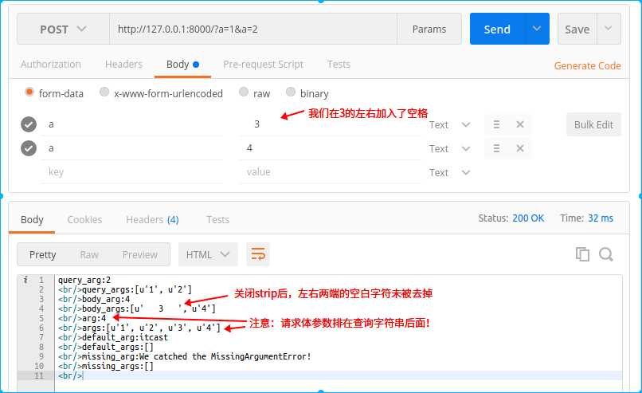
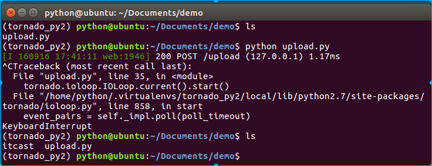
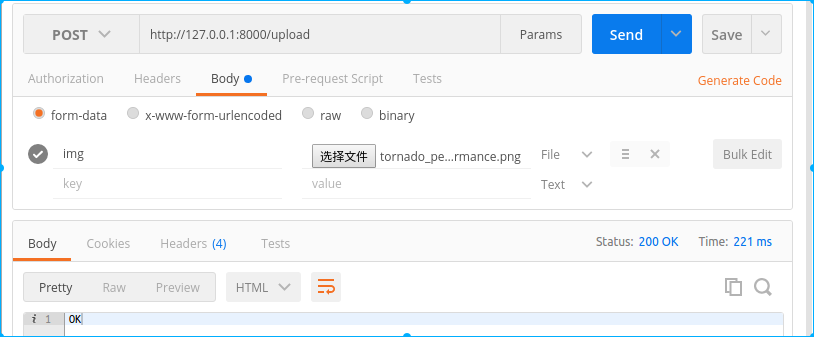

# 输入

下面几节主要讲解tornado.web.RequestHandler。

回想一下，利用HTTP协议向服务器传参有几种途径？

- 查询字符串（query string)，形如key1=value1&key2=value2；
- 请求体（body）中发送的数据，比如表单数据、json、xml；
- 提取uri的特定部分，如/blogs/2016/09/0001，可以在服务器端的路由中用正则表达式截取；
- 在http报文的头（header）中增加自定义字段，如X-XSRFToken=itcast。

我们现在来看下tornado中为我们提供了哪些方法来获取请求的信息。

## 1. 获取查询字符串参数

#### get_query_argument(name, default=_ARG_DEFAULT, strip=True)

从请求的查询字符串中返回指定参数name的值，如果出现多个同名参数，则返回最后一个的值。

default为设值未传name参数时返回的默认值，如若default也未设置，则会抛出tornado.web.MissingArgumentError异常。

strip表示是否过滤掉左右两边的空白字符，默认为过滤。

#### get_query_arguments(name, strip=True)

从请求的查询字符串中返回指定参数name的值，注意返回的是list列表（即使对应name参数只有一个值）。若未找到name参数，则返回空列表[]。

strip同前，不再赘述。

## 2. 获取请求体参数

#### get_body_argument(name, default=_ARG_DEFAULT, strip=True)

从请求体中返回指定参数name的值，如果出现多个同名参数，则返回最后一个的值。

default与strip同前，不再赘述。

#### get_body_arguments(name, strip=True)

从请求体中返回指定参数name的值，注意返回的是list列表（即使对应name参数只有一个值）。若未找到name参数，则返回空列表[]。

strip同前，不再赘述。

#### 说明

对于请求体中的数据要求为字符串，且格式为表单编码格式（与url中的请求字符串格式相同），即key1=value1&key2=value2，HTTP报文头Header中的"Content-Type"为application/x-www-form-urlencoded 或 multipart/form-data。对于请求体数据为json或xml的，无法通过这两个方法获取。

## 3. 前两类方法的整合

#### get_argument(name, default=_ARG_DEFAULT, strip=True)

从请求体和查询字符串中返回指定参数name的值，如果出现多个同名参数，则返回最后一个的值。

default与strip同前，不再赘述。

#### get_arguments(name, strip=True)

从请求体和查询字符串中返回指定参数name的值，注意返回的是list列表（即使对应name参数只有一个值）。若未找到name参数，则返回空列表[]。

strip同前，不再赘述。

#### 说明

对于请求体中数据的要求同前。 **这两个方法最常用**。

用代码来看上述六中方法的使用：

```
# coding:utf-8

import tornado.web
import tornado.ioloop
import tornado.httpserver
import tornado.options
from tornado.options import options, define
from tornado.web import RequestHandler, MissingArgumentError

define("port", default=8000, type=int, help="run server on the given port.")

class IndexHandler(RequestHandler):
    def post(self):
        query_arg = self.get_query_argument("a")
        query_args = self.get_query_arguments("a")
        body_arg = self.get_body_argument("a")
        body_args = self.get_body_arguments("a", strip=False)
        arg = self.get_argument("a")
        args = self.get_arguments("a")

        default_arg = self.get_argument("b", "itcast")
        default_args = self.get_arguments("b")

        try:
            missing_arg = self.get_argument("c")
        except MissingArgumentError as e:
            missing_arg = "We catched the MissingArgumentError!"
            print e
        missing_args = self.get_arguments("c")

        rep = "query_arg:%s<br/>" % query_arg
        rep += "query_args:%s<br/>" % query_args 
        rep += "body_arg:%s<br/>"  % body_arg
        rep += "body_args:%s<br/>" % body_args
        rep += "arg:%s<br/>"  % arg
        rep += "args:%s<br/>" % args 
        rep += "default_arg:%s<br/>" % default_arg 
        rep += "default_args:%s<br/>" % default_args 
        rep += "missing_arg:%s<br/>" % missing_arg
        rep += "missing_args:%s<br/>" % missing_args

        self.write(rep)

if __name__ == "__main__":
    tornado.options.parse_command_line()
    app = tornado.web.Application([
        (r"/", IndexHandler),
    ])
    http_server = tornado.httpserver.HTTPServer(app)
    http_server.listen(options.port)
    tornado.ioloop.IOLoop.current().start()
```



#### 注意：以上方法返回的都是unicode字符串

## 思考

1. 什么时候设置default，什么时候不设置default？
2. default的默认值_ARG_DEFAULT是什么？
3. 什么时候使用strip，亦即什么时候要截断空白字符，什么时候不需要？

## 4. 关于请求的其他信息

RequestHandler.request 对象存储了关于请求的相关信息，具体属性有：

- method HTTP的请求方式，如GET或POST;

- host 被请求的主机名；

- uri 请求的完整资源标示，包括路径和查询字符串；

- path 请求的路径部分；

- query 请求的查询字符串部分；

- version 使用的HTTP版本；

- **headers** 请求的协议头，是类字典型的对象，支持关键字索引的方式获取特定协议头信息，例如：request.headers["Content-Type"]

- **body** 请求体数据；

- **remote_ip** 客户端的IP地址；

- files

   

  用户上传的文件，为字典类型，型如：

  ```
  {
    "form_filename1":[<tornado.httputil.HTTPFile>, <tornado.httputil.HTTPFile>],
    "form_filename2":[<tornado.httputil.HTTPFile>,],
    ... 
  }
  ```

  tornado.httputil.HTTPFile是接收到的文件对象，它有三个属性：

  - filename 文件的实际名字，与form_filename1不同，字典中的键名代表的是表单对应项的名字；
  - body 文件的数据实体；
  - content_type 文件的类型。 这三个对象属性可以像字典一样支持关键字索引，如request.files["form_filename1"][0]["body"]。

我们来实现一个上传文件并保存在服务器本地的小程序upload.py：

```
# coding:utf-8

import tornado.web
import tornado.ioloop
import tornado.httpserver
import tornado.options
from tornado.options import options, define
from tornado.web import RequestHandler

define("port", default=8000, type=int, help="run server on the given port.")

class IndexHandler(RequestHandler):
    def get(self):
        self.write("hello itcast.")

class UploadHandler(RequestHandler): 
    def post(self):
        files = self.request.files
        img_files = files.get('img')
        if img_files:
            img_file = img_files[0]["body"]
            file = open("./itcast", 'w+')
            file.write(img_file)
            file.close()
        self.write("OK")

if __name__ == "__main__":
    tornado.options.parse_command_line()
    app = tornado.web.Application([
        (r"/", IndexHandler),
        (r"/upload", UploadHandler),
    ])
    http_server = tornado.httpserver.HTTPServer(app)
    http_server.listen(options.port)
    tornado.ioloop.IOLoop.current().start()
```

 

## 5. 正则提取uri

tornado中对于路由映射也支持正则提取uri，提取出来的参数会作为RequestHandler中对应请求方式的成员方法参数。若在正则表达式中定义了名字，则参数按名传递；若未定义名字，则参数按顺序传递。提取出来的参数会作为对应请求方式的成员方法的参数。

```
# coding:utf-8

import tornado.web
import tornado.ioloop
import tornado.httpserver
import tornado.options
from tornado.options import options, define
from tornado.web import RequestHandler

define("port", default=8000, type=int, help="run server on the given port.")

class IndexHandler(RequestHandler):
    def get(self):
        self.write("hello itcast.")

class SubjectCityHandler(RequestHandler):
    def get(self, subject, city):
        self.write(("Subject: %s<br/>City: %s" % (subject, city)))

class SubjectDateHandler(RequestHandler):
    def get(self, date, subject):
        self.write(("Date: %s<br/>Subject: %s" % (date, subject)))

if __name__ == "__main__":
    tornado.options.parse_command_line()
    app = tornado.web.Application([
        (r"/", IndexHandler),
        (r"/sub-city/(.+)/([a-z]+)", SubjectCityHandler), # 无名方式
        (r"/sub-date/(?P<subject>.+)/(?P<date>\d+)", SubjectDateHandler), #　命名方式
    ])
    http_server = tornado.httpserver.HTTPServer(app)
    http_server.listen(options.port)
    tornado.ioloop.IOLoop.current().start()
```

 

**建议：提取多个值时最好用命名方式。**