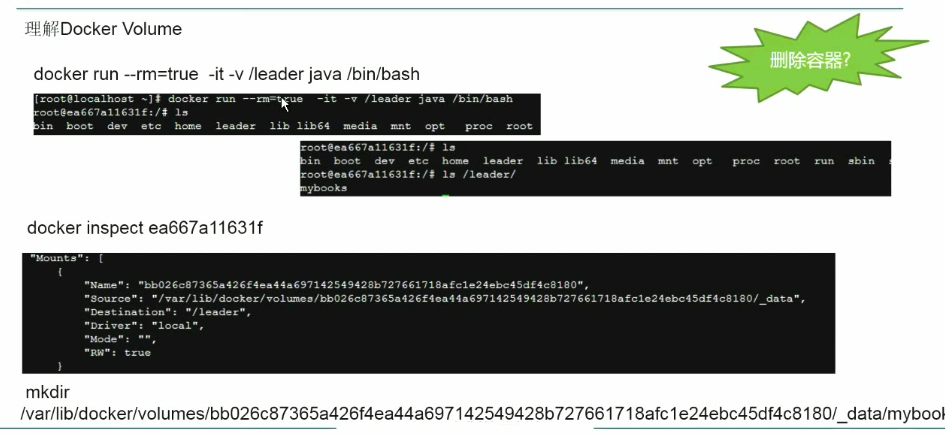
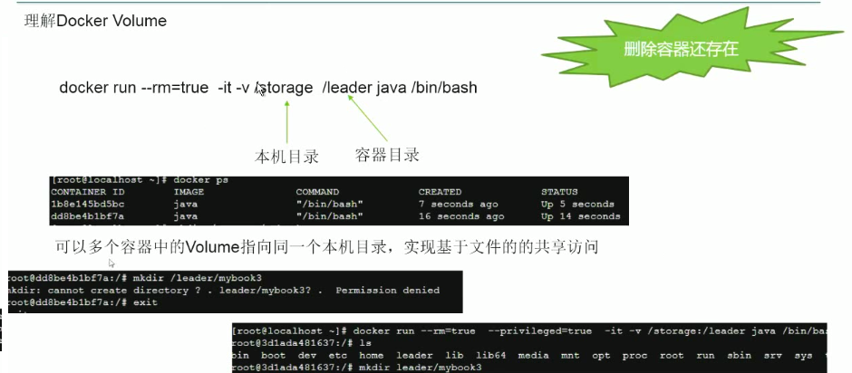
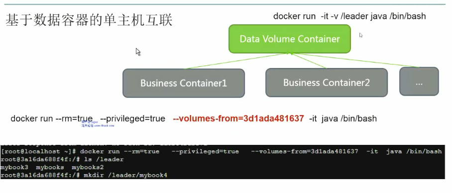

（1）查看docker的基本信息

`docker info`

`docker version `

（2）查找镜像

`docker search tornado`
`docker search -s 5 tornado	# 按照start数目`

（3）拉取镜像

`docker pull docker.io/centos`

（4）查看运行中的镜像示实例

`docker ps`
`docker ps -a`		# 查看包括暂停在内的所有的容器记录

（5）查看当前已有的镜像列表

`docker images`

（6）运行镜像

`docker run -it docker.io/centos  env`
`docker run -it -d docker.io/centos  /bin/bash`   	# d参数为daemon状态

（7）镜像标签

 `docker tag  pypy:origin  pypy:org`

 `docker tag  c42a8037264b  pypy:org`

（8）创建镜像

- 修改已有的镜像后，commit 方式

`docker commit -m "Added json gem" -a "docker Newbee" 0b2616b0e5a8 ouruser/sinatra:v2`

- 编写dockerfile 的方式，详见1.1

（9）删除镜像

`docker rmi xxxxxxxxxxxx` 

`docker rmi jasperxu/alpine` 

`docker image rm xxxxxxxxxxxx [-f]`

（10）导入和导出

- 导出本地文件到镜像

  - `docker save jasperxu/alpine:v3 > alpine.tar`  
  - `docker save -o ubuntu_14.04.tar ubuntu:14.04`

- 导入本地文件到镜像

  - `docker load < alpine.tar`
  - ` docker load --input ubuntu_14.04.tar`


（11）虚悬镜像

- 查找所有虚悬镜像

  - `docker image ls -f dangling=true` （-f：--filter）

  - ```
    # 想查看某个位置之前的镜像也可以，只需要把  since  换成  before  即可。
    # 此外，如果镜像构建时，定义了  LABEL  ，还可以通过  LABEL  来过滤。
    docker image ls -f since=mongo:3.2
    docker image ls -f label=com.example.version=0.1
    
    
    ```

  - 

- 清理无用的虚悬镜像

  - `docker image prune`


---


(7)基于volume的互联

-  让docker自己生成一个随机的文件并挂载在/mnt/docker_test ， 不可靠，重启后会消失

`docker run --rm=true -v /mnt/docker_test/ -it docker.io/centos` 
`docker run --rm=true -v /mnt/docker_test/ -it docker.io/centos /bin/bash`




- 执行本机的位置挂载

`docker run -it --rm=true -v /mnt/`docker_kkk/:/kkk  centos /bin/bash`

`docker run --rm=true --privileged=true --volumes-from=c42a8037264b -it centos /bin/bash`



- 使用`docker本身作为volume 的存储



docker默认是允许container互通，通过-icc=false关闭互通。一旦关闭了互通，只能通过-link name:alias命令
连接指定container. 
-- link redis:db的别名，会在/etc/hosts中生成对应的ip映射
`docker run --rm=true --name=myjavaserver:javaserver1 -it java /bin/bash`
`docker daemon --icc=false --iptables=true`

（7）更改网络

    $vim /usr/lib/systemd/system/docker.service
    ExecStart=/usr/bin/dockerd-current \
              --add-runtime docker-runc=/usr/libexec/docker/docker-runc-current \
              --default-runtime=docker-runc \
              --exec-opt native.cgroupdriver=systemd \
              --userland-proxy-path=/usr/libexec/docker/docker-proxy-current \
              --seccomp-profile=/etc/docker/seccomp.json \
              --bip=172.18.42.1/16 \ 
              $OPTIONS \
              $docker_STORAGE_OPTIONS \
              $docker_NETWORK_OPTIONS \
              $ADD_REGISTRY \
              $BLOCK_REGISTRY \
              $INSECURE_REGISTRY \
              $REGISTRIES
    $systemctl 


