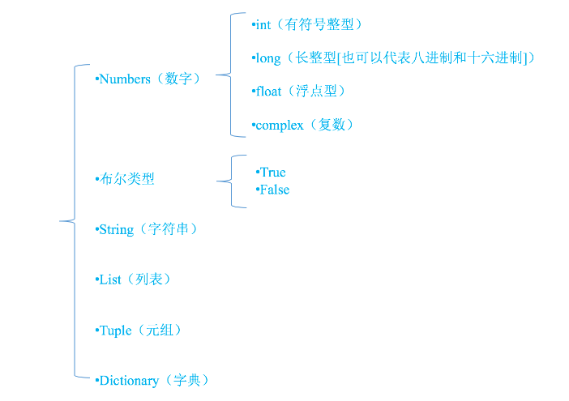
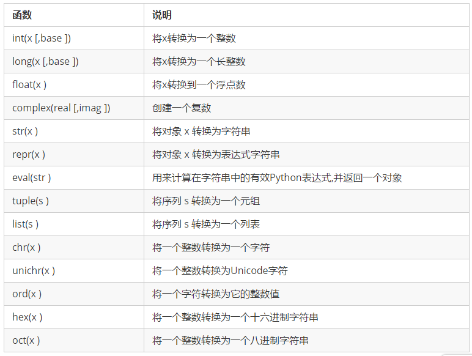

# Python初级

#### 1.Python程序的运行机制

- 逐行解释

  和C/C++/Java等语言需要提前静态编译不同。python的代码是逐行解释的。[缺少]()[静态编译的检查]()意味着在运行时可能会出现错误，导致代码稳定性差一些。PyChecker是一个python代码的静态分析工具，它可以帮助查找python代码的bug, 会对代码的复杂度和格式提出警告。

- 引用


- 查看变量在内存的id： `id(var)`

- 查看变量的引用次数（[PGC机制]()）：

  ```python
  import sys
  a = 2
  b = a
  sys.getrefcount(a)
  ```

- 可变对象和不可变对象

  - 不可变（immutable）：int、字符串(string)、float、（数值型number）、元组（tuple)
  - 可变（mutable）：字典型(dictionary)、集合(set)、列表型(list)、[无\__init__的class中的对象]()

- 深拷贝，浅拷贝

  - 在Python中=即引用，所以在必要时需要深拷贝 ， 对比以下情况的不同

    ```python
    #不的数据类型结果不同：
    #如果是可变类型：字典、列表传引用；基本数据类型传值
    def test(num):
        num += num
        # num = num + num
        print(num)

    test(a)
    print(a)
    ```

  - 使用深拷贝

    ```python
      # 万能
      from copy import deepcopy
      a = [100]
      b = deepcopy(a)
      print(id(a),id(b))

      # list等
      l = [100,200]
      ll = l[::]
    ```


​

#### 2.Python的变量

- 类型

  


- 类型转换函数 

  

- 判断一个变量的类型

  - 方法一

    ```python
    >>> a = 4
    >>> print type(a)
    <type 'int'>
    >>> type(a) == int
    True
    ```

  - 方法二

    ```python
    >>> a = 7
    >>> isinstance(a,int)
    True
    ```

    ​


#### 3.Python的关键字

- 什么是关键字

  > python一些具有特殊功能的标示符，这就是所谓的关键字
  >
  > 关键字，是python已经使用的了，所以不允许开发者自己定义和关键字相同的名字的标示符

- 查看关键字:

  ```python
        and     as      assert     break     class      continue    def     del
        elif    else    except     exec      finally    for         from    global
        if      in      import     is        lambda     not         or      pass
        print   raise   return     try       while      with        yield
  ```

- 通过代码查看

  ```python
  import keyword
  print(keyword.list)
  ```


#### 4.Python生成随机数

random模块

- 随机整数
  - random.randint(a,b)：返回随机整数x,a<=x<=b
  - random.randrange(start,stop,[,step])：返回一个范围在(start,stop,step)之间的随机整数，不包括结束值。
- 随机实数
  - random.random( ):返回0到1之间的浮点数
  - random.uniform(a,b):返回指定范围内的浮点数。
- random.shuffle(*x*[, *random*]) 
- random.sample(seq[, k])


#### 5.作用域

> 遵循LEGB原则：local-->enclosing function-->global-->build in

