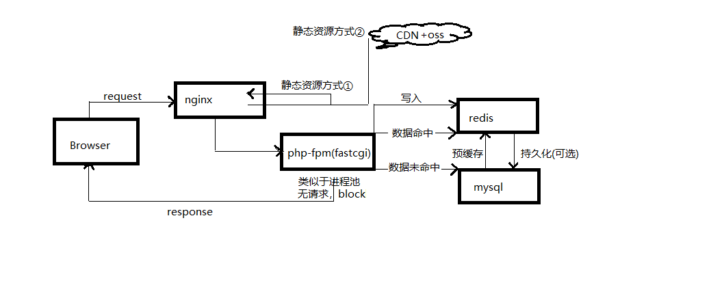
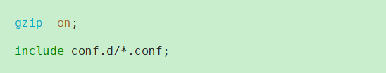
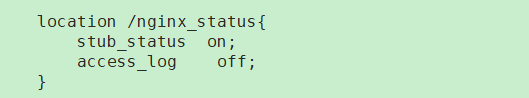
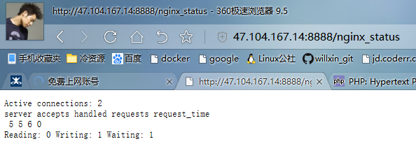
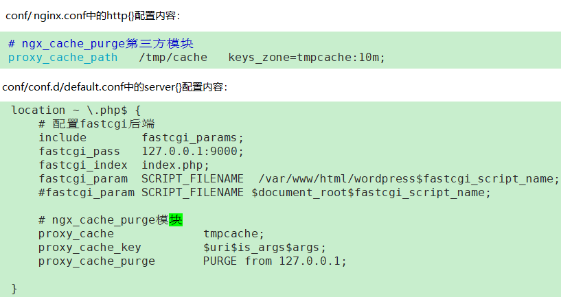
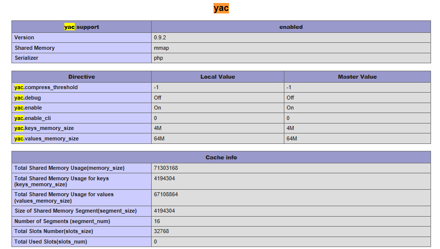
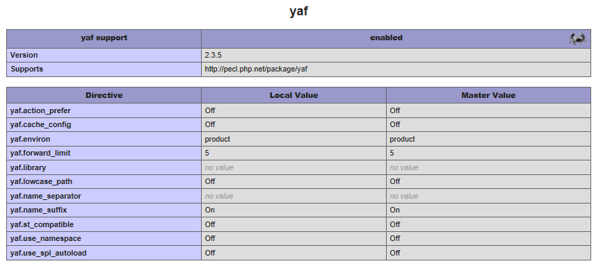
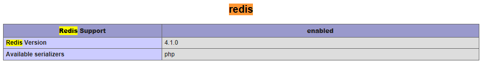
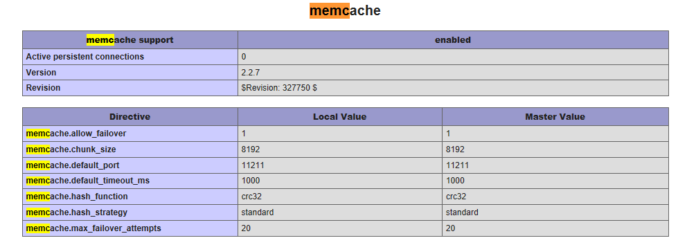

```
小练习：搭建LNMP环境： tengine 2.1.2  php5.6.30 mysql5.6.16 （tengine要求purge，status模块  php模块：yac yaf redis memcache ）

实现要求： 1 了解nginx基础配置，nginx规则，http状态码，http头信息

          2 了解nginx+php实现方式及原理，以及配置

          3  制作nginx，php模块rpm包

          4  书写搭建文档

文档要求： 架构图，文字描述具体的搭建过程，能够做基本的演示，心得体会
```

---

```
思路：
1、由于要部署nginx+php，使用php-fpm的fastcgi进程池模式，所以使用wordpress的php代码模拟
（部署后的网站打开慢，经排查是由于wordpress的css中引用google font，后将此功能关闭）
2、考虑到php、tengine软件需要安装第三方模块，下载源码包编译。
3、设计架构图思路如下，并加上了自己的一些思路^_^

任务检查URI：
wordpress: http://47.104.167.14:8888/
nginx-status：http://47.104.167.14:8888/nginx_status
php模块：http://47.104.167.14:8888/phpinfo.php
```





[TOC]


#### 1、下载安装tengine

###### （1）解耦配置文件，将*.conf独立目录，主配置文件include



###### （2）编译purge模块(purge多与视频处理有关，建议安装视频相关模块)


```shell

wget http://tengine.taobao.org/download/tengine-2.1.2.tar.gz
wget http://labs.frickle.com/files/ngx_cache_purge-2.3.tar.gz
wget ftp://ftp.csx.cam.ac.uk/pub/software/programming/pcre/pcre-8.39.tar.gz


./configure --prefix=/usr/local/tnginx \
--with-pcre=../pcre-8.39 \
--with-http_ssl_module \
--with-http_v2_module \
--with-http_flv_module \
--with-http_mp4_module \
--add-module=../ngx_cache_purge-2.3/
```

###### （3）http_stub_status模块的使用



```
返回各数据项说明：
Active connections: 当前nginx正在处理的活动连接数.
Server accepts handled requests request_time: nginx总共处理了5 个连接,成功创建5 握手(证明中间没有失败的),总共处理了6 个请求,总共请求时间0。
Reading: nginx读取到客户端的Header信息数.
Writing: nginx返回给客户端的Header信息数.
Waiting: 开启keep-alive的情况下,这个值等于 active – (reading + writing),意思就是nginx已经处理完成,正在等候下一次请求指令的驻留连接。
所以,在访问效率高,请求很快被处理完毕的情况下,Waiting数比较多是正常的.如果reading +writing数较多,则说明并发访问量非常大,正在处理过程中。
```





###### （4）ngx_cache_purge模块的使用

```
下载：http://github.com/FRiCKLE/ngx_cache_purge/
官网：http://labs.frickle.com/nginx_ngx_cache_purge/


官网建议配置：
Example configuration:
proxy_cache_path   /tmp/cache   keys_zone=tmpcache:10m;

location / {
	proxy_pass		    http://127.0.0.1:8000;
	proxy_cache		    tmpcache;
	proxy_cache_key		$uri$is_args$args;
	proxy_cache_purge	PURGE from 127.0.0.1;
}

```




#### 2、wget递归下载mysql-5.6.16需要的包

```shell
rpm -e mariadb-lib*

http://repo.mysql.com/yum/mysql-5.6-community/el/7/x86_64/

wget -r -nd -np -A 'mysql-community-*-5.6.16-1.el7.x86_64.rpm' \ http://repo.mysql.com/yum/mysql-5.6-community/el/7/x86_64/

配置数据库：
mysql_secure_install
mysql -uroot -p
>create database wordpress;
>grant all privileges on wordpress.* to 'root'@'%' identified by 'redhat';
>\q;
```


#### 3、php模块的安装

###### （1）安装php

```shell
./configure --prefix=/usr/local/php --with-config-file-path=/etc --enable-inline-optimization --disable-debug --disable-rpath --enable-shared --enable-opcache --enable-fpm --with-fpm-user=www --with-fpm-group=www --with-mysql=mysqlnd --with-mysqli=mysqlnd --with-pdo-mysql=mysqlnd --with-gettext --enable-mbstring --with-iconv --with-mcrypt --with-mhash --with-openssl --enable-bcmath --enable-soap --with-libxml-dir --enable-pcntl --enable-shmop --enable-sysvmsg --enable-sysvsem --enable-sysvshm --enable-sockets --with-curl --with-zlib --enable-zip --enable-dtrace --enable-maintainer-zts --with-bz2 --with-readline --without-sqlite3 --without-pdo-sqlite --with-pear

cp php.ini-production /etc/php.ini
```

###### （2）安装yac模块

```
Yac的应用场景
        让PHP进程之间共享一些简单的数据
        高效地缓存一些页面结果
Yac的限制
        缓存的键长度不能超过48字节，太长的话可以md5结果后再使用
        Value的最大长度不能超过64M，压缩后的长度不能超过1M
        当内存不够的时候, Yac会有比较明显的踢出率 (所以如果要使用Yac, 那么尽量多给点内存...)
  
  wget https://pecl.php.net/get/yac-0.9.2.tgz
  tar -zxvf yac-0.9.2.tgz
  cd yac-0.9.2
  phpize
  ./config --prefix=/usr/local/yac --with-php-config=/usr/local/php/bin/php-config
  sudo make && make install
  
接下来配置php.ini文件：
    vim /etc/php.ini
    //添加一下内容
    extension=php-yac.so
    [yac]
    yac.enable = 1 //是否开启yac，1表示开启， 0表示关闭
    yac.keys_memory_size = 4M //4M可以得到32768个key， 32M可以得到262144个key
    yac.values_memory_size = 64M //申请的最大value内存
    yac.compress_threshold = -1 //是否压缩数据
    yac.enable_cli = 0 //关闭在cli下使用yac
```



###### （3）安装yaf模块

```
Yaf是一个C语言编写的PHP框架，Yaf 的特点：
    用C语言开发的PHP框架, 相比原生的PHP, 几乎不会带来额外的性能开销.
    所有的框架类, 不需要编译, 在PHP启动的时候加载, 并常驻内存.
    更短的内存周转周期, 提高内存利用率, 降低内存占用率.
    灵巧的自动加载. 支持全局和局部两种加载规则, 方便类库共享.
    高性能的视图引擎.
    高度灵活可扩展的框架, 支持自定义视图引擎, 支持插件, 支持自定义路由等等.
    内建多种路由, 可以兼容目前常见的各种路由协议.
    强大而又高度灵活的配置文件支持. 并支持缓存配置文件, 避免复杂的配置结构带来的性能损失.
    在框架本身,对危险的操作习惯做了禁止.
    更快的执行速度, 更少的内存占用.
    
    
    
./configure --prefix=/usr/local/yaf --with-php-config=/usr/local/php/bin/php-config && make && make install && make test 
```



###### （4）安装redis模块




###### （5）安装memcached模块

