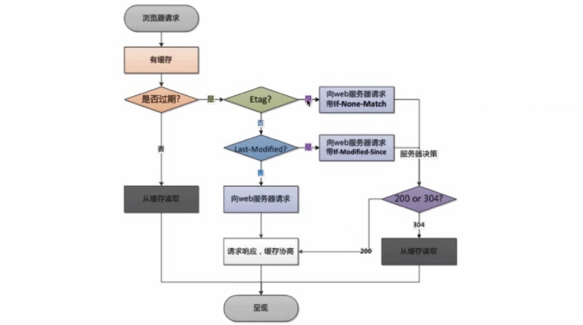
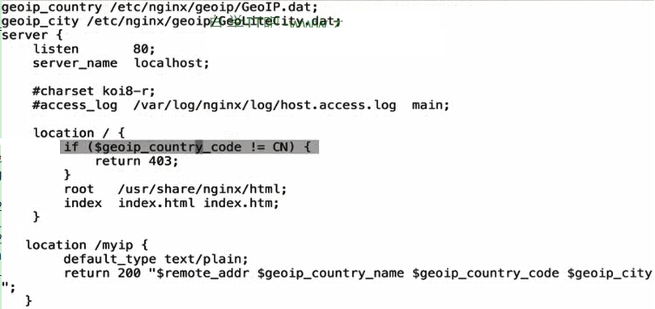

（1）Http校验过期机制

| Http校验过期机制        | 描述                                              |
| ----------------------- | ------------------------------------------------- |
| 检验是否过期            | Expires(http1.0)、Cache-Control(max-age)          |
| 协议中的Etag信息校验    | 字符串，相比Last-Modified，可更精准判断1s内的变化 |
| Last-Modified头信息校验 | 对比client与server的时间戳比对                    |

```
location ~  .*\.(html|htm)$ {
    expires 24h;
    root /var/www/html/;
}
```


（2）browser过期时间




(3) 跨域

```
location ~  .*\.(html|htm)$ {
    add_header Acess-Control-Allow-Origin http://www.qq.com;
    #add_header Acess-Control-Allow-Origin *;  # 允许所有的跨域域名
    add_header Acess-Control-Allow-Method GET,POST,PUT,DELETE,OPTIONS;
    root /var/www/html/;
}
```


（4）防盗链

```
location ~  .*\.(html|htm)$ {
    valid_referers none blocked 1.2.3.4;
               *.example.com example.* www.example.org/galleries/
               ~\.google\.;

    if ($invalid_referer) {
        return 403;
    }
    root /var/www/html/;
}

相关解释：
none：没有ref
blocked：不是不是标准ref
1.2.3.4：只允许ip方式

若不在valid_referers定义中，$valid_referers 置位1
```


(5) gzip压缩

```
gzip on;
gzip_min_length 1k;
gzip_buffers 4 16k;
#gzip_http_version 1.0;
gzip_comp_level 2;
gzip_types text/plain application/x-javascript text/css application/xml text/javascript application/x-httpd-php image/jpeg image/gif image/png;
gzip_vary off;
gzip_disable "MSIE [1-6]\.";

相关解释：
第1行：开启Gzip
第2行：不压缩临界值，大于1K的才压缩，一般不用改
第3行：buffer，就是，嗯，算了不解释了，不用改
第4行：用了反向代理的话，末端通信是HTTP/1.0，有需求的应该也不用看我这科普文了；有这句的话注释了就行了，默认是HTTP/1.1
第5行：压缩级别，1-10，数字越大压缩的越好，时间也越长，看心情随便改吧
第6行：进行压缩的文件类型，缺啥补啥就行了，JavaScript有两种写法，最好都写上吧，总有人抱怨js文件没有压缩，其实多写一种格式就行了
第7行：跟Squid等缓存服务有关，on的话会在Header里增加"Vary: Accept-Encoding"，我不需要这玩意，自己对照情况看着办吧
第8行：IE6对Gzip不怎么友好，不给它Gzip了

测试命令：
curl -I -H "Accept-Encoding: gzip, deflate" "http://www.slyar.com/blog/wp-content/plugins/wp-multicollinks/wp-multicollinks.css"
```


（6）后端服务器在负载均衡中的调度状态

| 状态         | 描述                                                       |
| ------------ | ---------------------------------------------------------- |
| down         | 当前server不参与负载均衡                                   |
| backup       | 预留的备份服务器，其他的节点down调的情况下提供服务         |
| max_fails    | 最大允许失败的次数，次数用完就歇一会                       |
| fail_timeout | 经过max_fails失败后，服务器在暂停的时间                    |
| max_conns    | 限制最大的接受的连接数，解决性能差、优的服务器在一起的情况 |

（7）调度算法

| 算法         | 描述                                   |
| ------------ | -------------------------------------- |
| 轮询         | 按照时间顺序之一分配到不同的后端服务器 |
| 加权轮询     | weight值越大，分配到的几率越大         |
| ip_hash      | 每个请求IP被黏在一台服务器上           |
| least_conn   | 那个机器连接数少就分配到哪台           |
| url_hash     | 每个请求url被黏在一台服务器上          |
| hash关键数值 | hash自定义的KEY                        |

（8）nginx高级模块

【1】secure_link_module模块

- 制定并允许检查请求的链接的真实性以及免遭未经授权的访问
- 限制链接生效周期


```shell
Example:

location /s/ {
    secure_link $arg_md5,$arg_expires;
    secure_link_md5 "$secure_link_expires$uri$remote_addr secret";

    if ($secure_link = "") {
        return 403;
    }

    if ($secure_link = "0") {
        return 410;
    }

    ...
}

The “/s/link?md5=_e4Nc3iduzkWRm01TBBNYw&expires=2147483647” link restricts access to “/s/link” for the client with the IP address 127.0.0.1. The link also has the limited lifetime until January 19, 2038 (GMT).

On UNIX, the md5 request argument value can be obtained as:

echo -n '2147483647/s/link127.0.0.1 secret' | \
    openssl md5 -binary | openssl base64 | tr +/ -_ | tr -d =
```

【2】geoip_module模块



【3】使用https，生成CA证书

```
三步生成法：
$ openssl genrsa -desc3 -out jesonc.key 1024 （生成私钥）
$ openssl req -new -key jesonc.key -out jesonc.csr (可以交给第三方的签名机构用的)
$ openssl x509 -req -days 3650 -in jesonc.csr -singkey jesonc.key -out jesonc.crt （利用key、csr生成自签证书）
一步生成法：
$openssl req -days 36500 -x509 -sha256 -nodes -newkey rsa:2048 -keyout jesonc.key -out jesonc_apple.crt （用Key直接生成crt）
去掉key保护码的方式：
$openssl rsa -in ./jeson.key -out ./jeson_nopass.key
```

【4】Nginx与Lua开发

- Lua基础语法

```
1、注释
--行注释
--[[
    块注释
--]]

2、
```

