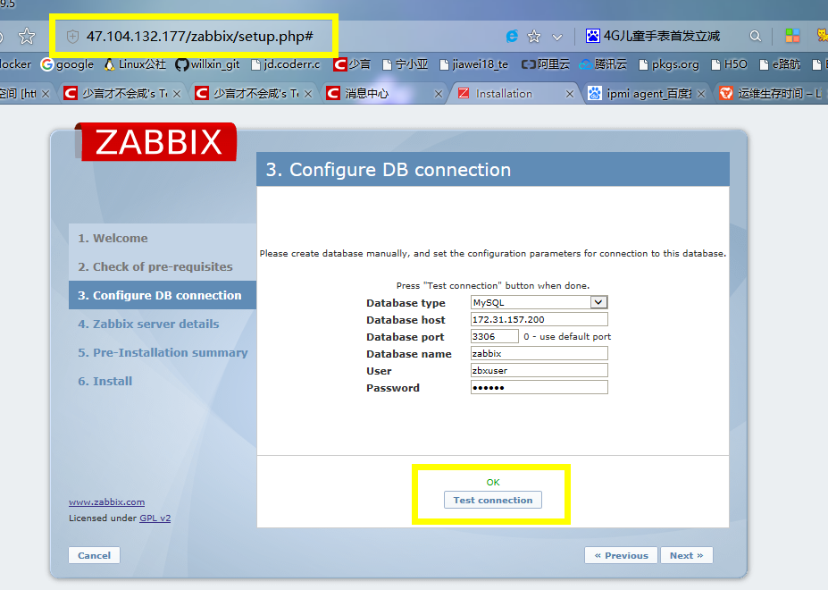
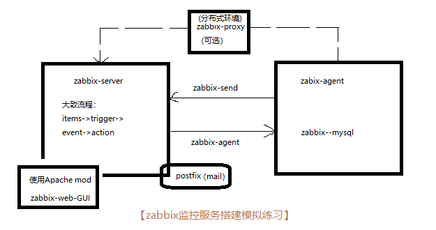
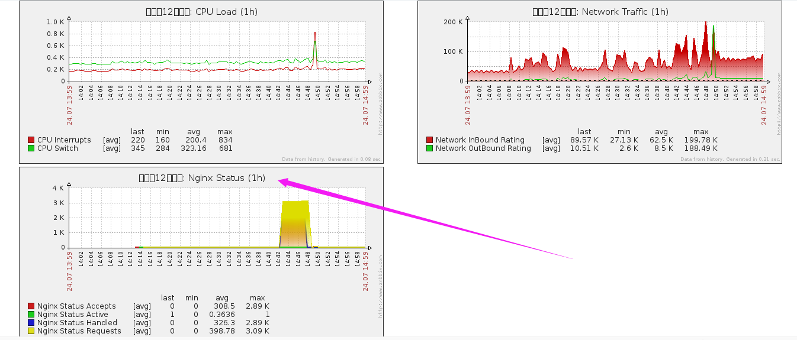
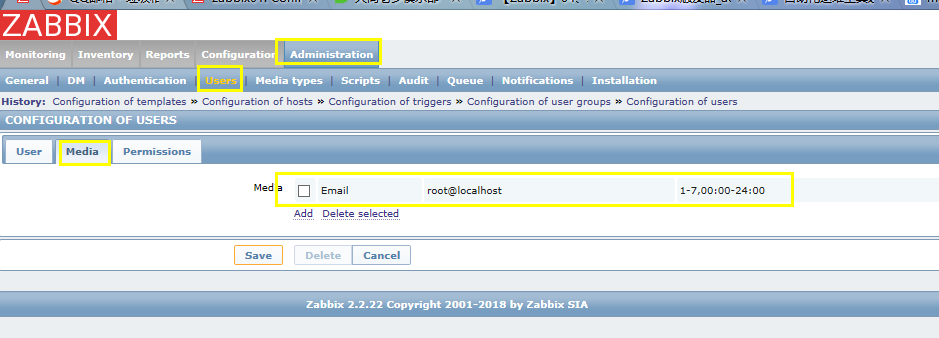
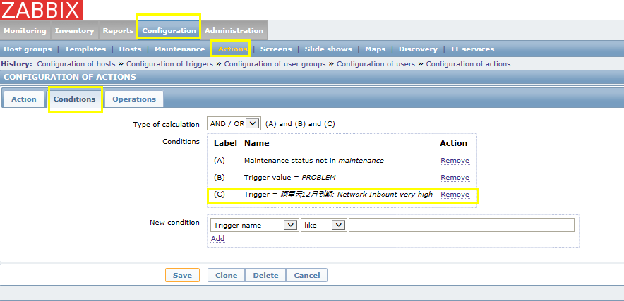
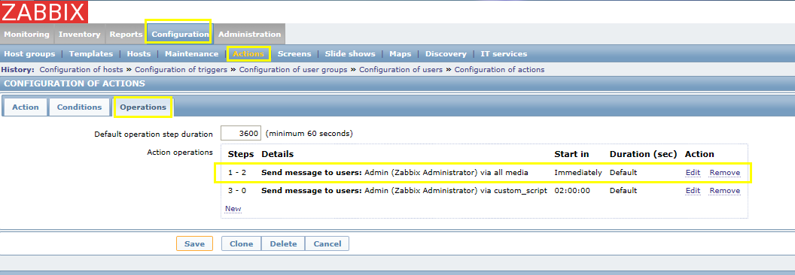
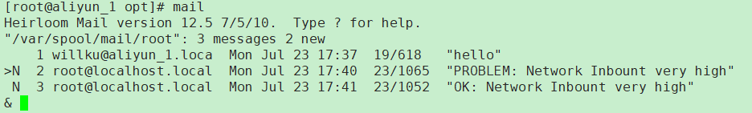

[TOC]


#### 1、数据采集的手段

- snmp（v2通用，加密明文）
- 自定义agent
- ssh（机器的账号、密码）

#### 2、常见的监控
cacti
- 采集数据（依赖于snmp、脚本）
- 保存数据
- 数据展示
- 数据分析及报警

nagios（报警工具）
- 依赖关系定义
- 只关心正常与否的状态
- 数据的保存（需要插件）


>zabbix功能简述：
>
>​	工作流程：数据采集-->数据存储-->数据分析及展示-->报警
>
>​	数据采集：SNMP、agent、ICMP/SSH/IPMI(对网络设备管理等)
>
>​	数据存储：mysql、pgsql、oracle
>
>​	数据展示：web（默认采用的是php）
>
>​	报警方式：mail(smtp)、SMS、custom
>
>​	监控对象：手动添加、自动发现
>
>​	关联概念：
>
>​		hosts，host group
>
>​		item（key），application
>
>​		graph，screen
>
>​		trigger-->event (discovery)-->action(notification，operation，condition)
>
>
>
>完整过程：
>
>添加主机(主机组)-->添加item(内置简单图形)-->trigger(event:problem-->ok[Recovery]) -->action{(通知信息，使用了大量的宏)，condition（自定义触发条件），operation(step分步进行)}


#### 3、安装zabbix
##### （1）源码安装

- 同时安装server和agent，并支持将数据放入mysql数据中，可使用类似如下的配置命令：

`./configure --enable-server --enable-agent --with-mysql --enable-ipv6 --with-net-snmp --with-libcurl`

- 如果仅仅安装server，并支持将数据放入mysql中，可使用如下的配置命令

`./configure --enable-server  --with-mysql  --with-net-snmp `

- 如果仅仅安装proxy，并支持将数据放入mysql中，可使用如下的配置命令

`./configure --prefix=/usr/local --enable-proxy  --with-mysql  --with-net-snmp --with-ssh2`

- 如果仅仅安装agent，可使用如下的配置命令
  `./configure --enable-agent`

而后编译安装zabbix即可
\# make && make install

##### （2）rpm包安装

官网包组下载地址：

https://www.zabbix.com/download?zabbix=2.2&os_distribution=centos&os_version=7&db=MySQL

- server端安装（默认监听10051）
  `yum -y install zabbix.x86_64 zabbix-get.x86_64 zabbix-server.x86_64 zabbix-server-mysql.x86_64  zabbix-web.noarch zabbix-web-mysql.noarch `

- agent端安装（默认监听10050）

  `yum -y install zabbix.x86_64  zabbix-agent.x86_64 zabbix-sender.x86_64`

- proxy端安装

  `yum -y install zabbix.x86_64 zabbix-proxy.x86_64 zabbix-proxy-mysql.x86_64  `

#### 4、配置数据库

server和proxy得运行都依赖于数据库，agent则不需要

以Mysql数据库为例：
```shell
# 找到数据库配置sql文件，下一步创建好数据库导入
[root@aliyun_1 ~]# rpm -ql zabbix-server-mysql | grep -E '\.sql$'
/usr/share/doc/zabbix-server-mysql-2.2.22/create/data.sql
/usr/share/doc/zabbix-server-mysql-2.2.22/create/images.sql
/usr/share/doc/zabbix-server-mysql-2.2.22/create/schema.sql

mysql> CREATE DATABASE zabbix DEFAULT CHARACTER SET utf8mb4 COLLATE utf8mb4_general_ci;
mysql> GRANT ALL ON zabbix.* TO 'zbuser'@'%' IDENTIFIED BY 'zbpass' ;
# 请按需要修改用户名和密码
shell> mysql -u<username> -p<password> zabbix < database/mysql/schema.sql ;
# 如果仅为proxy创建数据库，只导入schema.sql即可，否则，请继续下面的步骤
shell> mysql -u<username> -p<password> zabbix < database/mysql/images.sql ;
shell> mysql -u<username> -p<password> zabbix < database/mysql/data.sql ;


# 远程登陆的sql(与此无关)
[root@aliyun_1 ~]# mysql -uroot -predhat -h 172.31.157.200
mysql> grant all on *.* to 'root'@'172.16.%.%' identified by 'redhat' with grant option;
mysql> flush privileges;
mysql> \q
```


#### 5、zabbix-web安装

##### （1）安装Apache 的httpd

##### （2）查看zabbix生成的httpd的conf文件

```
[root@aliyun_1 ~]# rpm -ql zabbix-web|grep -E '\.conf'
/etc/httpd/conf.d/zabbix.conf
```

##### （3）编辑PHP中的时区（可选）

```
[root@aliyun_1 ~]# vim /etc/php.ini
[Date]
; Defines the default timezone used by the date functions
; http://php.net/date.timezone
date.timezone = Asia/Shanghai

[root@aliyun_1 ~]# sytemctl restart httpd
```

##### （4）安装过程,测试通过




#### 6、zabbix配置

##### （1）Item，Key(键)：

​	需要唯一，可以接受参数。ethercard.traffic[eth0]

##### （2）trigger触发器

>基本的触发器：`{<server>:<key>.<function>(<parameter>)}<operator><constant>` 
>
>server : 主机名称
>
>key : 主机上关系的相应监控项的key;
>
>funtion：评估采集到的数据是否合理范围内时所使用的函数，其评估过程可以根据采集的数据、当前时间及其它因素进行；
>
>触发器所支持的函数有avg、count、change、date、dayofweek、delta、diff、iregexp、last、max、min、nodata、now、sum等
>
>
>parameter：函数参数；大多数数值函数可以接受秒数为其参数，而如果在数值参数之前使用"#"作为前缀，则表示为最近几次的取值，如果sum(300)表示300秒内所有取值之和，而sum(#10)则表示最近10次取值之和；
>
>此外，avg、count、last、min和max还支持使用第二个参数，用于完成时间限定；例如，max(1h,7d)将返回一周之前的最大值;
>
>**触发器表达式例子:**
>
>`{www.samlee.com:system.cpu.load[all,avg1].last(0)}>3`   对last函数来说，last(0)相当于last(#1)
>
>
>
>| PRIORITY | OPERATOR | DEFINITION                                                   |
>| -------- | -------- | ------------------------------------------------------------ |
>| 1        | /        | Division                                                     |
>| 2        | *        | Multiplication                                               |
>| 3        | -        | Arithmetical minus                                           |
>| 4        | +        | Arithmetical plus                                            |
>| 5        | <        | Less than. The operator is defined as: A<B <=> (A<=B-0.000001) |
>| 6        | >        | More than. The operator is defined as: A>B <=> (A<=B+0.000001) |
>| 7        | #        | Not equal. The operator is defined as:A#B <=>(A<=B-0.000001)\|(A>=B+0.000001) |
>| 8        | =        | Is equal. The operator is defined as:A=B <=>(A<=B-0.000001)\|(A>=B+0.000001) |
>| 9        | &        | Logical AND                                                  |
>| 10       | \|       | Logical OR                                                   |

##### （3）event事件

>Zabbix的时间是基于时间戳进行标记，它们是采取动作(action)如发送邮件通知的基础，其主要来源于三种途径:
>
>触发器(trigger)事件:触发器状态每次发生改变，都会生成相应"事件"，且通常包含详细信息，如发生的时间及新的状态等；
>
>发现(discovery)事件: zabbix会周期性扫描"网络发现规则"中指定的IP范围，一旦发现主机或服务，就会生成一个或几个发现事件；
>
>发现事件有8类: Service Up、Service Down、Host Up、Host Down、Service Discovered、Service Lost、Host Discovered和Host Lost;
>
>主动agent自动发现事件(也称为"自动注册事件"，Auto registtation events): 当一个此前状态未知的主动agent发起检测请求时会生成此举事件；
>
>内部事件(Internal events)：Item变成不再支持或trigger变成未知状态
>
>LLD：low level disvcovery，较低层的自动发现

##### (4) 媒介类型（Media Type）

>E-mail: 电子邮件，即通知邮件的方式传送通知信息；
>
>SMS: 手机短信，即通过连接至zabbix服务器GSM Modem发送通知；
>
>Jabber： jabber消息；Jabber是一个开发的、基于XML的协议，能够实现基于Internet或LAN的即时通讯服务；
>
>自定义的通知脚本:以上方式不能满足需求时，Zabbix可以调用位于其配置文件"AlertScriptPath"变量所定义的脚本查找目录中的脚本来完成通知功能

##### （5）template模板

>一系列配置的集合，它可以方便地快速部署在某个监控对象上，并且支持重复使用，一次修改，多处修改；
>
>包括：items，triggers，graphs，applications，screens，low-level discover rules
>
>模板可以继承的，即：在创建模板时，可以链接其他模板；
>
>模板的应用方法：link，unlink，unlink and clear

##### （6）宏

>Zabbix宏是一种抽象(Abstraction),它根据一系列预定义的规则替换一定得文本模式，而解释器或编译器在遇到宏时会自动进行这一模式替换；
>
>Zabbix基于宏保存预设文本模式，并且在调用时将其替换为其中的文本；
>
>Zabbix有许多内置的宏，如{HOST.NAME}、{HOST.IP}、{TRIGGER.DESCRIPTION}、{TRIGGER.NAME}、
>
>{TRIGGER.EVENTS.ACK}等
>
>Zabbix为了更强的灵活性，zabbix还支持在全局、模板或主机级别使用用户自定义宏(user macro);
>
>用户自定义宏要使用"{$MACRO}"这种特殊的语法格式；宏可以应用在item keys和descriptions、trigger名称和表达式、主机接口IP/DNS及端口、discovery机制的SNMP协议的相关信息中等；宏名称只能使用大写字母、数字及下划线
>
>Zabbix宏的替换次序:首先是主机级别宏；其次是当前主机上一级模板中(直接链接至主机的模板)的宏，多个一级模板按其ID号排序；再接着是二级模板中的宏；而后依次类推；最后检查的是全局宏；zabbix如果无法查找到某主机定义使用的宏，则不会对其进行替换操作。要使用用户自定义宏，有以下两种途径:
>
>**-->全局宏:"Administrator-->General-->Macros"**
>
>**-->主机或模板级别的宏: 编辑相应的主机或模板属性即可**

##### (7) UserParameter

>让被监控端执行一个zabbix没有预定义的检测，zabbix的用户自定义参数功能提供了这个方法。可以在客户端配置文件目录/etc/zabbix/ 下的zabbix_agentd.d/*.conf或zabbix_angentd.conf里面配置UserParameter.
>语法如下: `UserParameter=<key>,<command>`
>
>注意事项：
>
>1、一个用户自定义参数包含一个key和一个命令，key必须整个系统唯一
>
>2、配置item的时候，在key的位置填上我们自定义的key即可
>
>3、配置好之后，重启客户端。
>
>4、用户自定义参数里指定的脚本由zabbix agent来执行，最大可以返回512KB的数据
>
>
>
>> 例子：
>> UserParameter=mysql.ping,mysqladmin -uroot  ping|grep -c alive
>>
>> 如果返回1表示MySQL运行中，如果返回0表示MySQL挂了
>
>
>
>**灵活的自定义key：如下为灵活的用户自定义参数:**
>
>| **参数**    | **描述**                                                     |
>| ----------- | ------------------------------------------------------------ |
>| **Key**     | 唯一. [*]表示里面可以传递多个参数                            |
>| **Command** | 需要执行的脚本，key的[]里面的参数一一对应$1到$9，一共9个参数。$0表示脚本命令. |
>
>注意事项
>1、如果需要使用命令行里面出现$2这种变量，那么你要使用两个$$2，例如awk ’{ print $$2 }’，之前就遇到过这个问题，不停的测试自己脚本输出正常，但是zabbix却拿不到数据，原来是出在这里。为了防止和参数冲突，所以zabbix做了这个规定。
>2、zabbix禁止使用一些不安全的参数，如下:
>
> `\ ' ”  ? [ ] { } ~ $ ! & ; ( ) < > | # @` 
>
>3、从zabbix 2.0开始，zabbix返回文本数据可以是空格。
>
>>例子：
>>
>>UserParameter=memory.usage[*],/usr/bin/cat /proc/meminfo |awk "/^$1/ {print $$2}"
>

(8) discovery自动发现

>发现的两个阶段：发现，action
>
>​	action：定义condition、operation
>
>发现基于：
>
>​	IP Range、拓展服务（FTP\SSH\WEB）、zabbix-agent信息、snmp信息
>
>​	
>
>​	


---

#### 模拟练习

```
小练习：
	搞个zabbix 把你的服务监控起来
	基础资源 像 内存 cpu 硬盘 这些应该都有模板,
	然后应用 nginx  php状态,访问状态 都可以放到里面
		
```



##### 1、监控nginx

###### (1)准备自定义userparameter脚本

```shell
#!/usr/bin/env bash
NGINX_PORT=8888  
MONITOR_IPADDR="http://127.0.0.1"
NGINX_COMMAND=$1
nginx_active(){
    /usr/bin/curl -s "$MONITOR_IPADDR:$NGINX_PORT/nginx_status/" |awk '/Active/ {print $NF}'
}
nginx_reading(){
    /usr/bin/curl -s "$MONITOR_IPADDR:$NGINX_PORT/nginx_status/" |awk '/Reading/ {print $2}'
}
nginx_writing(){
    /usr/bin/curl -s "$MONITOR_IPADDR:$NGINX_PORT/nginx_status/" |awk '/Writing/ {print $4}'
       }
nginx_waiting(){
    /usr/bin/curl -s "$MONITOR_IPADDR:$NGINX_PORT/nginx_status/" |awk '/Waiting/ {print $6}'
       }
nginx_accepts(){
    /usr/bin/curl -s "$MONITOR_IPADDR:$NGINX_PORT/nginx_status/" |awk 'NR==3 {print $1}'
       }
nginx_handled(){
    /usr/bin/curl -s "$MONITOR_IPADDR:$NGINX_PORT/nginx_status/" |awk 'NR==3 {print $2}'
       }
nginx_requests(){
    /usr/bin/curl -s "$MONITOR_IPADDR:$NGINX_PORT/nginx_status/" |awk 'NR==3 {print $3}'
       }

case $NGINX_COMMAND in
active)
	nginx_active;
;;
reading)
	nginx_reading;
;;
writing)
	nginx_writing;
;;
waiting)
	nginx_waiting;
;;
accepts)
	nginx_accepts;
;;
handled)
	nginx_handled;
;;
requests)
	nginx_requests;
;;
*)
	echo $"USAGE:$0 {active|reading|writing|waiting|accepts|handled|requests}"
esac

```

(2)编辑zabbix_agentd.conf

```
### Option: UserParameter
#	User-defined parameter to monitor. There can be several user-defined parameters.
#	Format: UserParameter=<key>,<shell command>
#	See 'zabbix_agentd' directory for examples.
#
# Mandatory: no
# Default:

UserParameter=nginx.status[*],/usr/bin/bash /opt/nginx_monitor.sh '$1'
```

(3)zabbix的template添加items、graph、screen，监控主机link模版




##### 2、使用zabbix发送警报（启动系统邮件服务postfix）

###### (1)设置user的媒介



###### (2)设置action



###### (3)设置operation



###### (4)查看警告邮件



