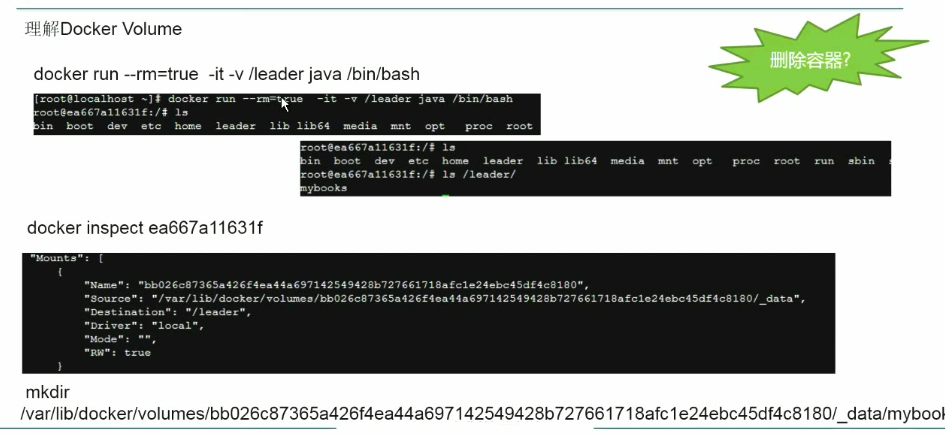
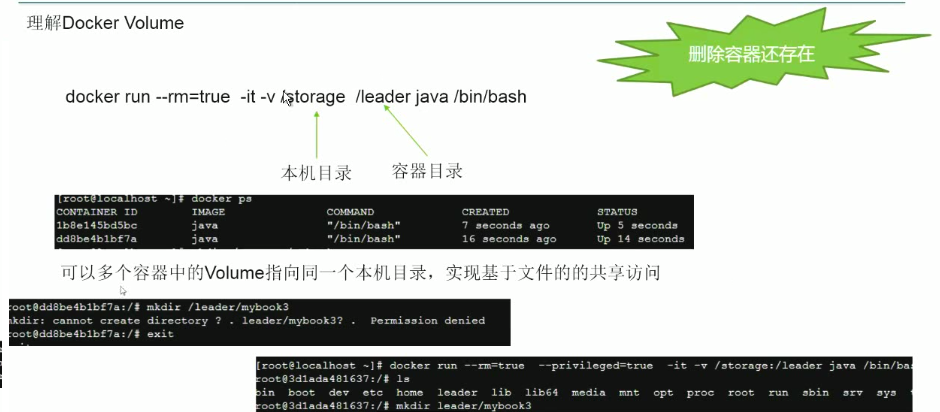
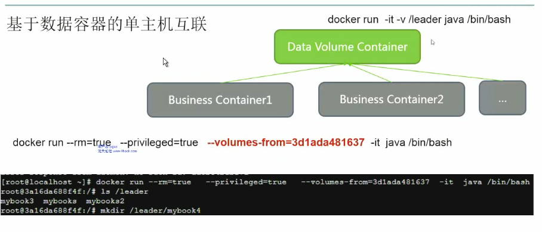

（1）查看docker的基本信息

docker info

docker version 

（2）查找镜像

docker search tornado
docker search -s 5 tornado #按照start数目

（3）拉去镜像

docker pull docker.io/centos

（4）查看运行中的镜像示实例

docker ps
docker ps -a

（5）查看当前已有的镜像

docker images

（6）运行镜像

docker run -it docker.io/centos  env
docker run -it docker.io/centos  /bin/bash
docker top c42a8037264b
docker inspect c42a8037264b
docker stop c42a8037264b 

docker exec -it c42a8037264b /bin/bash  # 交互式运行

(7)基于volume的互联

-  让docker自己生成一个随机的文件并挂载在/mnt/docker_test ， 不可靠，重启后会消失

docker run --rm=true -v /mnt/docker_test/ -it docker.io/centos  
docker run --rm=true -v /mnt/docker_test/ -it docker.io/centos /bin/bash

- 执行本机的位置挂载

docker run -it --rm=true -v /mnt/docker_kkk/:/kkk  centos /bin/bash

docker run --rm=true --privileged=true --volumes-from=c42a8037264b -it centos /bin/bash

- 使用docker本身作为volume 的存储

docker默认是允许container互通，通过-icc=false关闭互通。一旦关闭了互通，只能通过-link name:alias命令
连接指定container. 
-- link redis:db的别名，会在/etc/hosts中生成对应的ip映射
docker run --rm=true --name=myjavaserver:javaserver1 -it java /bin/bash
docker daemon --icc=false --iptables=true

（7）更改网络

    $vim /usr/lib/systemd/system/docker.service
    ExecStart=/usr/bin/dockerd-current \
              --add-runtime docker-runc=/usr/libexec/docker/docker-runc-current \
              --default-runtime=docker-runc \
              --exec-opt native.cgroupdriver=systemd \
              --userland-proxy-path=/usr/libexec/docker/docker-proxy-current \
              --seccomp-profile=/etc/docker/seccomp.json \
              --bip=172.18.42.1/16 \ 
              $OPTIONS \
              $DOCKER_STORAGE_OPTIONS \
              $DOCKER_NETWORK_OPTIONS \
              $ADD_REGISTRY \
              $BLOCK_REGISTRY \
              $INSECURE_REGISTRY \
              $REGISTRIES
    $systemctl 

